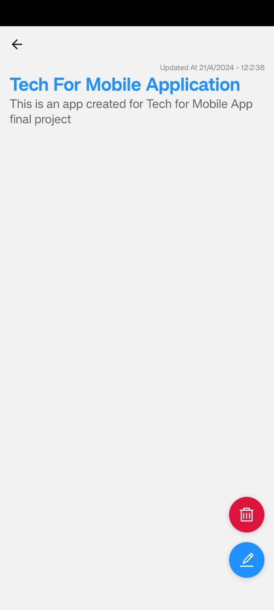

### Welcome to Notes App Using React Native 📘.

#### Team Members  
1. Anurag Sharma Pendyala
2. Nithin Janagani
3. Vani Pulluri

### Project Description 

This is the implementation of notes app in react-native using the expo-cli and **AsyncStorage**. Expo CLI is used for developing the app whereas, AsyncStorage is used to perform **CRUD** operations like Creating a note, Remove a note, Update a note and Delete a note. 

__Project Domain__: In this fast-paced world it is really hard to carry a book and pen everywhere you go. Nowadays, Mankind are mostly reliable on technology and smartphones. This project aims to solves this problem through simple note taking application that allows them to keep track of their notes without carrying a notebook everywhere they go.

__Project Objective__: The "Notes App" aims to create a user-friendly app which is simple yet intuitive for everyone. It uses the power of react native and AsyncStorage to accomplish this goal.

__Solution__: The "Note App" tries to solve this problem by providing a way to create notes, update a note, delete a note and Remove a note utilising asynchronous storage module available for react native.

__Target Audience__: The target audience for this app are any individuals who are intrested in taking notes on their mobile phones and have a quick glance to all the important notes whenever and whereever required.

### Running the project 🚀
After cloning the project follow the following step to run the project:

1. To install node modules use the `npm i` in the cloned repository.

2. Upgrade expo SDK and its dependencies using 
```
npm install expo latest
npx expo install --fix

```
> [!NOTE]
> Note : Do this if and only if your expo version is not up-to-date. You can check your version in package.json

3. To start the application type `npx expo start` and scan the qr code in expo app to preview the project.


### Screenshots of the Project
<hr/>


1. Welcome Screen
<picture>

</picture>
<br>

2. Initial Note Screen (Notes)
<picture>

</picture>
<br>

3. Create Note Screen
<picture>

</picture>
<br>

4. Updated Note Screen
<picture>

</picture>
<br/>

5. Note Preview Screen
<picture>

</picture>
<br/>

6. Note Deletion Screen
<picture>

</picture>
<br/>

7. Notes Screen After Deletion
<picture>

</picture>
<br/>

8. Note Search Screen
<picture>

</picture>
<br/>

9. Search results not found screen 
<picture>

</picture>
<br/>


<footer>
Thanks for visiting the repo 😀.
__Technologies used__:
<div  style="display: flex; width: 300px;
margin-inline: auto; ">


</div>
</footer>


